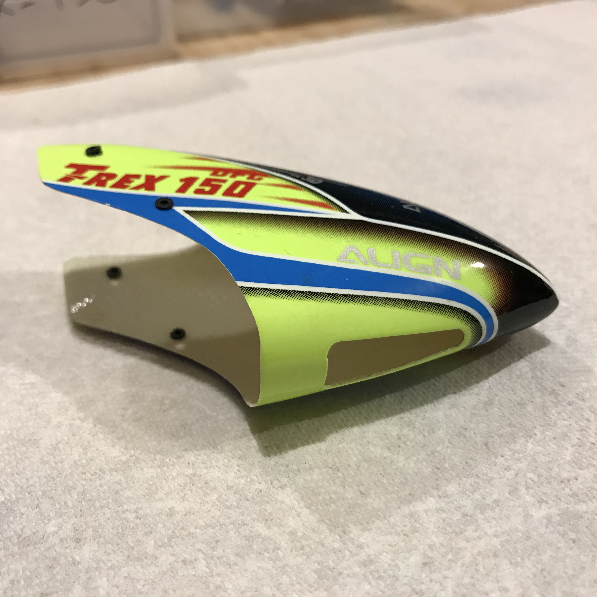
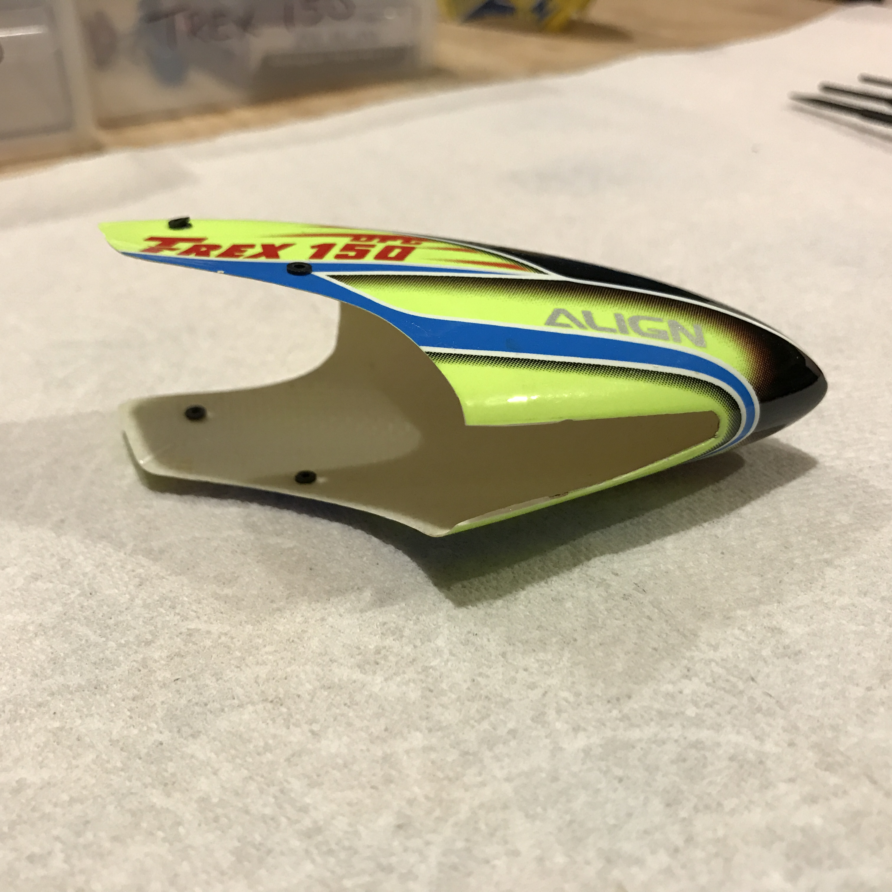

# Canopy Modification

The battery for your 150X should “snap” into place when you insert it before
flight.  Out of the box, the stock 150X canopies (both plastic and fiberglass)
interfere with the battery connector, making it difficult-to-impossible to
fully seat the battery:

… if your battery isn’t fully seated, it will likely come loose, either at
startup or during flight.  So I consider the following modification a must-do:

Use a straightedge and a hobby knife to score the plastic / fiberglass.  Don’t
try to cut all the way through the material in a single cut.  Continue cutting
in light passes until you’ve gone all the way through the material.
