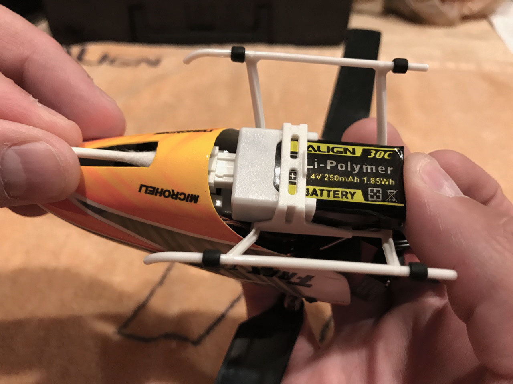
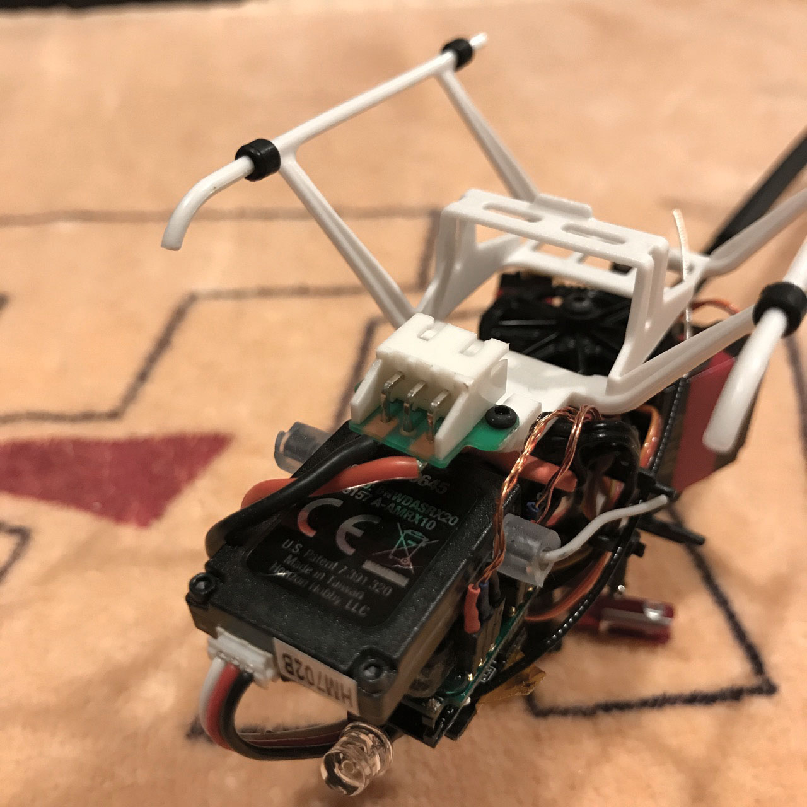

# Canopy Modification

The battery for your 150X needs to “snap” into place when you insert it before
flight … if your battery isn’t fully seated, it will likely come loose, either
at startup or during flight.

Unfortunately, two out-of-the-box problems combine to make this difficult.
First, if you watch closely, you will see that the battery connector flexes
slightly when you try to snap the battery into place.  Second, the stock 150X
canopies (both plastic and fiberglass) prevent you from providing any support
for the battery connector:

This makes it difficult-to-impossible to fully seat the
battery.  Fortunately, there are two ways to address this.  The first is to modify the canopy so that
you can support the connector with a finger as you snap the battery into place:

Use a straightedge and a hobby knife to score the plastic / fiberglass.  Don’t
try to cut all the way through the material in a single cut.  Continue cutting
in light passes until you’ve gone all the way through the material.
This modification also makes the stock fiberglass canopy easier to install - it
is nearly impossible to install the unmodified canopy without damaging the
gelcoat.

If you have a canopy that fits properly to begin with, or you don't want to start
cutting into a brand-new purchase, an alternative approach is to use a nonconductive
object to provide pressure on the back of the battery connector when installing a battery:

**WARNING** - if you use this approach, be very, very sure that the object you use is nonconductive; I
like to use a Q-tip, because this procedure puts pressure on the wires on the back of the connector,
which are energized as soon as the battery is inserted:

