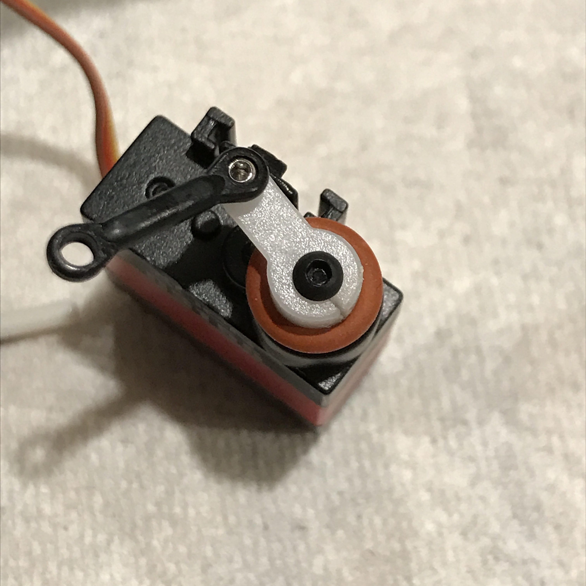

During any crash, the blades can transmit significant force through the pitch
links and swash into the servos on your 150X, and this can easily strip the
plastic gears in the servos.  To make damage less likely, I consider the
servo-saver modification a must-do:

There are two steps to the modification, visible in the photo:

* Cut a slot in the back of the servo horn, using a hobby knife or a jeweler’s saw.
* Place an O-ring around the servo horn.  In this case I used **006 Silicone O-Ring, 70A Durometer, Red, 1/8" ID, 1/4" OD, 1/16” Width**.

Here’s how the modification works: during flight, pressure from the o-ring
clamps the servo horn to the splined servo shaft, so that it functions
normally.  In a crash, the slot in the horn allows it to expand and rotate
around the splined servo shaft, greatly reducing the force transmitted to the
gears inside.  Thus, it acts as a mechanical fuse to protect the servo, and all
you have to do after a crash is reset the position of the servo horn.
